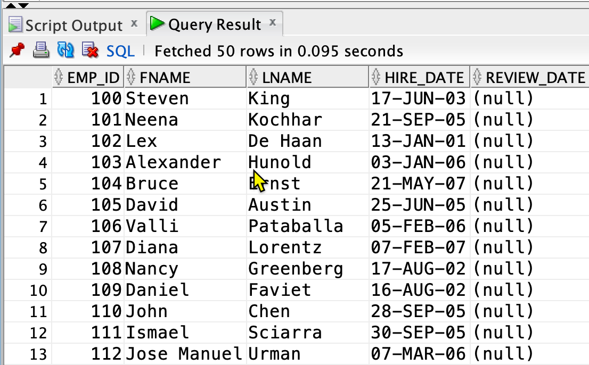
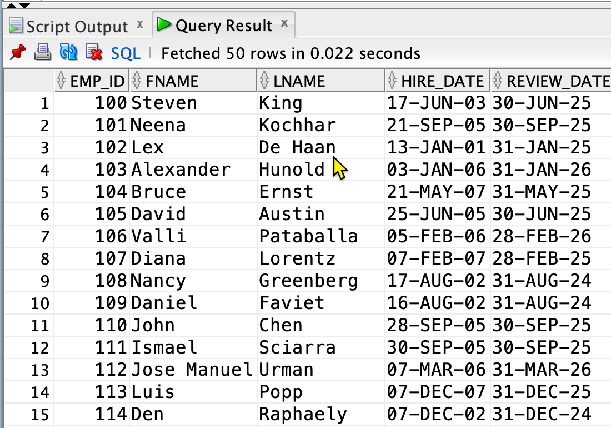

# Title 

P15. Use an explicit cursor to update or delete rows in a table.

## Description

Say you want to update or delete rows in a table based on some complex conditions that cannot be expressed in a single SQL statement. 

In this case, you can use an explicit cursor to iterate each row to update or delete it based on the conditions.

Because Oracle allows multiple sessions for a single database, there is a possibility that another session tries to update or delete the same rows after you open a cursor. Hence, you must lock the rows of the cursor to prevent other sessions from modifying them.

To lock the rows, we use the `FOR UPDATE` clause in the `SELECT` statement. 

When you use the cursor for-loop to update a row, we use the `WHERE CURRENT OF <cursor>` clause to reference the current row in the cursor. The clause can make the update statement shorter and more readable.

In short,
1. Why do we need to use an explicit cursor for DML operations? The conditions are too complex to express in a single SQL statement. 
2. When do we use the `FOR UPDATE` clause?  We need to update or delete rows with an explicit cursor.
3. When do we use the `WHERE CURRENT OF <cursor>` clause? We need to reference the current row in the cursor to update or delete it.

## Example 

Create a table `emp_review_list` as the following:

```sql
create table emp_review_list(emp_id, fname, lname, hire_date, review_date) as 
select employee_id, first_name, last_name, hire_date, cast(null as date)
from employees;
```



Each employee needs to be reviewed on the end of the month every two years since the hire date.

For example, if an employee is hired on 2005-01-15, the first review date is 2007-01-31, the second review date is 2009-01-31, and so on.

The steps to calculate the review date is as follows:
1. Calculate the next review cycle for an employee:

```
review_cycle = trunc((months_between(sysdate, hire_date) / 24)) + 1
```

`trunc((months_between(sysdate, hire_date) / 24))` is the number of cycles that have passed since the hire date. We add 1 to get the next cycle.

2. Calculate the review date for an employee:

``` 
review_date = last_day(add_months(hire_date, review_cycle * 24))
```

`add_months(hire_date, review_cycle * 24)` is the date of the next review cycle. `last_day` returns the last day of the month. A review cycle is 24 months (2 years).


With the above steps, we can write a PL/SQL block to update the next review date for each employee in the `emp_review_list` table.

In the block, we will:
1. Declare an explicit cursor with the `FOR UPDATE` clause.
2. Use the cursor for-loop to iterate each row.
3. When updating a row, use the `WHERE CURRENT OF` clause to reference the current row in the cursor.
   

```sql
set serveroutput on
declare
    cursor c_emp_review_list is
        select *
        from emp_review_list
        -- #1
        for update; -- Lock the entire rows for update
    l_review_cycle number;
    l_review_date date;
begin
    for emp in c_emp_review_list loop
        l_review_cycle := trunc((months_between(sysdate, emp.hire_date) / 24)) + 1;
        l_review_date := last_day(add_months(emp.hire_date, l_review_cycle * 24));
        -- #2 modify the review_date field in the emp record variable
        emp.review_date := l_review_date;
        -- #3 Update the table
        update emp_review_list
            set ROW = emp
            where current of c_emp_review_list;
    end loop;
end;
/
```



Several modifications can be made to the above block to make it more efficient:

1. If you just want to update the `review_date` column, not the entire row, you can use the `FOR UPDATE OF <column>` clause to lock only the `review_date` column.

2. In the cursor for-loop, we use the record variable `emp` to update a row. If you just update the `review_date` column, rewrite the update statement as follows:

```sql
...
    emp.review_date := review_date;
update emp_review_list
    set review_date = review_date
    where current of c_emp_review_list;
...
```

The version of updating single column is as follows:
```sql
set serveroutput on
declare
    cursor c_emp_review_list is
        select *
        from emp_review_list
        -- #1
        for update of review_date; -- Lock the entire rows for update
    l_review_cycle number;
    l_review_date date;
begin
    for emp in c_emp_review_list loop
        l_review_cycle := trunc((months_between(sysdate, emp.hire_date) / 24)) + 1;
        l_review_date := last_day(add_months(emp.hire_date, l_review_cycle * 24));
        -- #2 modify the review_date field in the emp record variable
        update emp_review_list
            set review_date = l_review_date
            where current of c_emp_review_list;
    end loop;
end;
/
```

